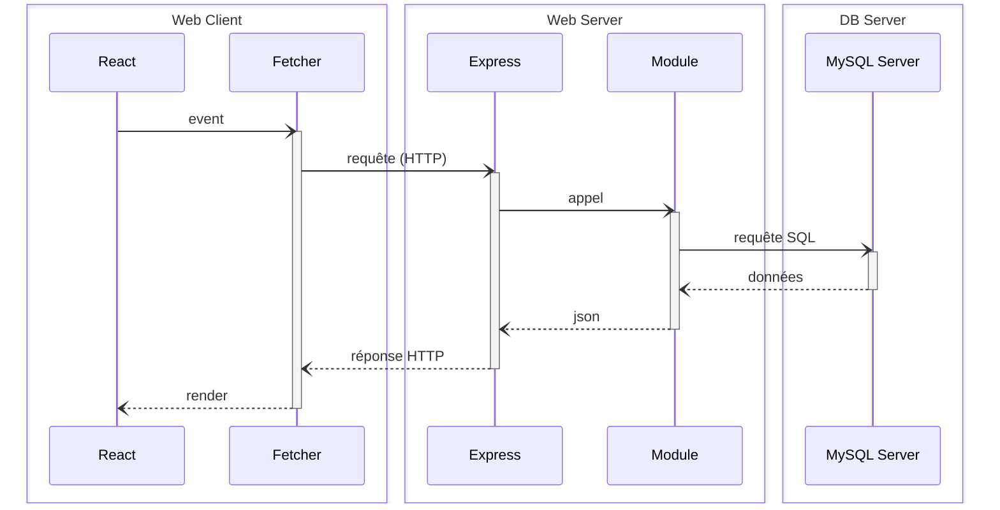

# Monorepos.... DU CHAOS !

Ce projet est un monorepo JS, suivant l'architecture React-Express-MySQL telle qu'enseignée à la Wild Code School (v7.1.7)...

...à la différence près que tout les linters ont été retirés



Il est pré-configuré avec un ensemble d'outils pour aider les étudiants à produire du code de qualité industrielle, tout en restant un outil pédagogique :

- **Concurrently** : Permet d'exécuter plusieurs commandes simultanément dans le même terminal.
- **Vite** : Alternative à _Create-React-App_, offrant une expérience plus fluide avec moins d'outils.
- **Supertest** : Bibliothèque pour tester les serveurs HTTP en node.js.

## Utilisateurs Windows

Assurez-vous de lancer ces commandes dans un terminal Git pour éviter [les problèmes de formats de nouvelles lignes](https://en.wikipedia.org/wiki/Newline#Issues_with_different_newline_formats) :

```sh
git config --global core.eol lf
git config --global core.autocrlf false
```

## Installation & Utilisation

2. Clonez ce dépôt, puis accédez au répertoire cloné.
3. Exécutez la commande `npm install`.
4. Créez des fichiers d'environnement (`.env`) dans les répertoires `server` et `client` : vous pouvez copier les fichiers `.env.sample` comme modèles (**ne les supprimez pas**).

## Les choses à retenir

### Commandes de Base

| Commande               | Description                                                                 |
|------------------------|-----------------------------------------------------------------------------|
| `npm install`          | Installe les dépendances pour le client et le serveur                       |
| `npm run db:migrate`   | Met à jour la base de données à partir d'un schéma défini                   |
| `npm run dev`          | Démarre les deux serveurs (client et serveur) dans un seul terminal         |
| `npm run test`         | Exécute les tests unitaires et d'intégration                                |

### Mettre en place la base de données

**Créer et remplir le fichier `.env`** dans le dossier `server` :

```plaintext
DB_HOST=localhost
DB_PORT=3306
DB_USER=not_root
DB_PASSWORD=password
DB_NAME=my_database
```

**Les variables sont utilisés** dans `server/database/client.ts` :

```typescript
const { DB_HOST, DB_PORT, DB_USER, DB_PASSWORD, DB_NAME } = process.env;

import mysql from "mysql2/promise";

const client = mysql.createPool({
  host: DB_HOST,
  port: DB_PORT as number | undefined,
  user: DB_USER,
  password: DB_PASSWORD,
  database: DB_NAME,
});

export default client;
```

**Créer une table** dans `server/database/schema.sql` :

```sql
CREATE TABLE item (
  id INT AUTO_INCREMENT PRIMARY KEY,
  title VARCHAR(255) NOT NULL,
  user_id INT NOT NULL,
  FOREIGN KEY(user_id) REFERENCES user(id)
);
```

**Insérer des données** dans `server/database/schema.sql` :

```sql
INSERT INTO item (title, user_id) VALUES
  ('Sample Item 1', 1),
  ('Sample Item 2', 2);
```

**Synchroniser la BDD avec le schema** :

```sh
npm run db:migrate
```

### Développer la partie back-end

**Créer une route** dans `server/app/router.ts` :

```typescript
// ...

/* ************************************************************************* */
// Define Your API Routes Here
/* ************************************************************************* */

// Define item-related routes
import itemActions from "./modules/item/itemActions";

router.get("/api/items", itemActions.browse);

/* ************************************************************************* */

// ...
```

**Définir une action** dans `server/app/modules/item/itemActions.ts` :

```typescript
import type { RequestHandler } from "express";

import itemRepository from "./itemRepository";

const browse: RequestHandler = async (req, res, next) => {
  try {
    const items = await itemRepository.readAll();

    res.json(items);
  } catch (err) {
    next(err);
  }
};

export default { browse };
```

**Accéder aux données** dans `server/app/modules/item/itemRepository.ts` :

```typescript
import databaseClient from "../../../database/client";

import type { Result, Rows } from "../../../database/client";

interface Item {
  id: number;
  title: string;
  user_id: number;
}

class ItemRepository {
  async readAll() {
    const [rows] = await databaseClient.query<Rows>("select * from item");

    return rows as Item[];
  }
}

export default new ItemRepository();
```

**Ajouter un middleware** 

```typescript
// ...

/* ************************************************************************* */
// Define Your API Routes Here
/* ************************************************************************* */

// Define item-related routes
import itemActions from "./modules/item/itemActions";

const foo: RequestHandler = (req, res, next) => {
  req.message = "hello middleware";

  next();
}

router.get("/api/items", foo, itemActions.browse);

/* ************************************************************************* */

// ...
```

`req.message` sera disponible dans `itemActions.browse`.

⚠️ La propriété `message` doit être ajoutée dans `src/types/express/index.d.ts` :

```diff
// to make the file a module and avoid the TypeScript error
export type {};

declare global {
  namespace Express {
    export interface Request {
      /* ************************************************************************* */
      // Add your custom properties here, for example:
      //
      // user?: { ... };
      /* ************************************************************************* */
+      message: string;
    }
  }
}
```

### REST

| Opération | Méthode | Chemin d'URL | Corps de la requête | SQL    | Réponse (Succès)               | Réponse (Erreur)                                                       |
|-----------|---------|--------------|---------------------|--------|--------------------------------|------------------------------------------------------------------------|
| Browse    | GET     | /items       |                     | SELECT | 200 (OK), liste des items.     |                                                                        |
| Read      | GET     | /items/:id   |                     | SELECT | 200 (OK), un item.             | 404 (Not Found), si id invalide.                                       |
| Add       | POST    | /items       | Données de l'item   | INSERT | 201 (Created), id d'insertion. | 400 (Bad Request), si corps invalide.                                  |
| Edit      | PUT     | /items/:id   | Données de l'item   | UPDATE | 204 (No Content).              | 400 (Bad Request), si corps invalide. 404 (Not Found), si id invalide. |
| Destroy   | DELETE  | /items/:id   |                     | DELETE | 204 (No Content).              | 404 (Not Found), si id invalide.                                       |

### Logs

Pour accéder aux logs de votre projet en ligne (pour suivre le déploiement ou surveiller les erreurs), connectez-vous à votre VPS (`ssh user@host`). Ensuite, allez dans votre projet spécifique et exécutez `docker compose logs -t -f`.